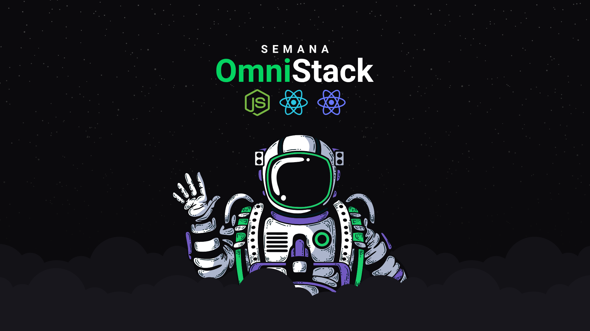
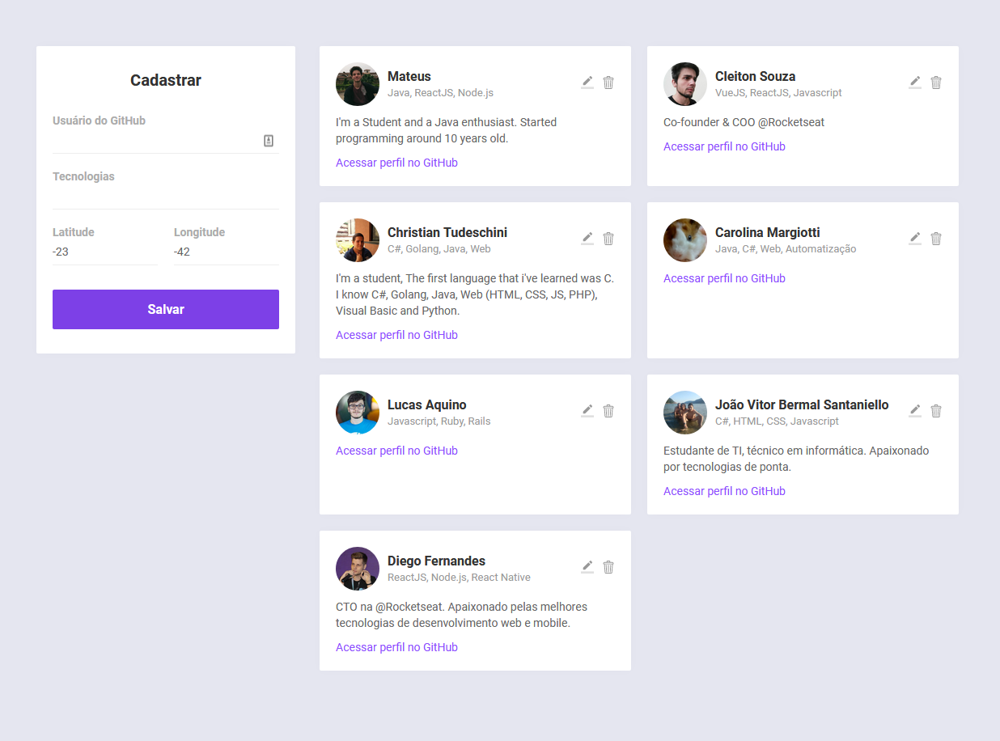
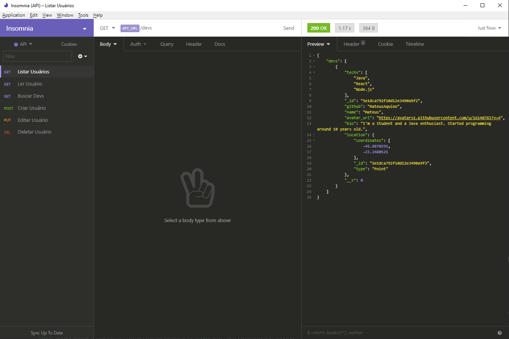

</img>
<h1 align="center">Semana Omnistack 10</h1>
<p align="center">Projeto <strong>DevRadar</strong> desenvolvido durante a Omnistack da Rocketseat</p>

<p align="center">
  <a aria-label="Versão do Node" href="https://github.com/nodejs/node/blob/master/doc/changelogs/CHANGELOG_V12.md#12.14.1">
    </img>
  </a>
  <a aria-label="Versão do React" href="https://github.com/facebook/react/blob/master/CHANGELOG.md#16120-november-14-2019">
    </img>
  </a>
  <a aria-label="Desafios" href="DESAFIOS.md">
  	</img>
  </a>
  <a aria-label="Dia 3 de 5" href="https://rocketseat.com.br/week-10/aulas#3">
    </img>
  </a>
</p>

## Instalação
Configure o MongoDB e atualize a string de conexão com seu `User:Senha` no arquivo `index.js`.  
Para instalar as dependências e executar o Servidor (modo desenvolvimento), clone o projeto em seu computador e em seguida execute:
```bash
cd Backend
yarn install
yarn dev
```
Para iniciar o Frontend do React utilize o comando:
```bash
cd web
yarn install
yarn start
```
Assim que o processo terminar, automaticamente será aberta no seu navegador a página `localhost:3000` contendo o Projeto desenvolvido até agora (Dia 3 de 5).

## Backend
Veja em [Backend/README.md](./Backend) para informações sobre o Backend e arquitetura.

## Frontend
Veja em [web/README.md](./web) para informações sobre o Frontend e os padrões. O Frontend desenvolvido no Dia 3 (com o [desafio](DESAFIOS.md) feito) ficou assim:

</img>

## Imnsonia 
Para testar a API do DevRadar, baixe e instale o [Insomnia](https://insomnia.rest/download/) e em seguida clique na Workspace → `Import/Export` →  
`Import Data` → `From File` → e selecione o arquivo ` 	Insomnia_export.json` deste repositório. Assim que terminar, o resultado ficará assim:  

</img>

## Licença

[MIT](./LICENSE) &copy; [Rocketseat](https://rocketseat.com.br/)
